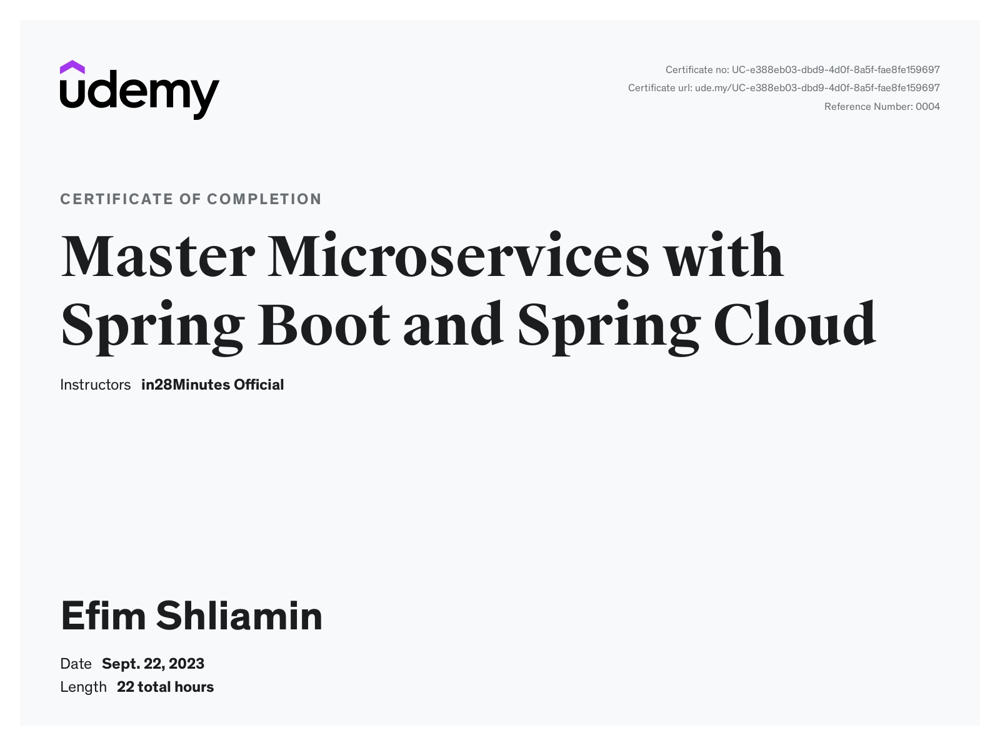

 # songsMS
**KBE-Abschlussbeleg SoSe2023**

👨🏼‍💻 Efim Shliamin (Matrikelnummer: 573270)

💡 _You can use 	[the Talend API Tester](https://chrome.google.com/webstore/detail/talend-api-tester-free-ed/aejoelaoggembcahagimdiliamlcdmfm/related) (Google Chrome extension) as a REST API client to invoke, discover and test HTTP and REST APIs._

💡 _We use [Swagger](https://swagger.io/) for developing and describing RESTful APIs. Go to http://localhost:8080/swagger-ui/index.html to try._

💡 _Content Negotiation: we use [fasterxml](https://mvnrepository.com/artifact/com.fasterxml.jackson.core) for implementing support for XML._

💡 _We use [HAL Explorer](https://toedter.github.io/hal-explorer/release/reference-doc/) for browsing and exploring HAL and HAL-FORMS-based RESTful Hypermedia APIs. Go to [http://localhost:8080/swagger-ui/index.html](http://localhost:8080/explorer) to try._

Please go to https://github.com/shliamin/songsMS-spring-boot

💡 _We use [Eureka](https://www.baeldung.com/spring-cloud-netflix-eureka) as a Registry/Discovery-Service. Go to http://localhost:8761/ to try._

💡 _We use [Zipkin](https://zipkin.io) as a a distributed tracing system. Go to http://localhost:9411/ to try._

💡 _We use [Docker](https://www.docker.com)._

**Step-by-step solution:** (provided [by this course](https://www.udemy.com/course/microservices-with-spring-boot-and-spring-cloud/) on Udemy)

1. Designing the REST API

2. Creating User Bean and UserDaoService (data access object)

3. Implementing the GET methods for User Resources

4. Implementing the POST method to create User Resources

5. Enhancing the POST method to return the correct HTTP status code (201)

6. Implementing Exception Handling - 404 - Resource Not Found

7. Implementing Generic Exception Handling for all Resources

8. Implementing the DELETE Method to delete a User Resource

9. Implementing Validations for REST API

10. Configuring Auto Generation of Swagger Documentation

11. Content Negotiation: Implementing support for XML

12. Internationalization for REST API

13. Versioning REST API - URI Versioning (http://localhost:8080/v1/person vs http://localhost:8080/v2/person)

14. Versioning REST API - Request Param, Header, Media Type (VersioningPersonController)

15. Implementing HATEOAS (Hypermedia as the Engine of Application State) for REST API

16. Implementing Static Filtering for REST API

17. Implementing Dynamic Filtering for REST API

18. Monitoring API with Spring Boot Actuator

19. Exploring APIs with Spring Boot HAL Explorer

20. Creating User Entity and some test data. Go to http://localhost:8080/h2-console

21. Enhancing REST API to connect to H2 using JPA and Hibernate

22. Creating Post Entity with Many To One Relationship with User Entity

23. Implementing a GET API to retrieve all Posts of a User

24. Implementing a POST API to create a Post for a User

25. Exploring JPA and Hibernate Queries for REST API

26. Connecting REST API to MySQL Database - Implementation

27. Implementing Basic Authentication with Spring Security

28. Enhancing Spring Security Configuration for Basic Authentication

# songsMS - microservices

1. Setting up Limits Microservice

2. Creating a hard-coded limits service

3. Enhance limits service - Get configuration from application props

4. Setting up Spring Cloud Config Server

5. Installing Git and Creating Local Git Repository

6. Debugging problems with Spring Cloud Config Server

7. Connect Spring Cloud Config Server to Local Git Repository

8. Connect Limits Service to Spring Cloud Config Server

9. Configuring Profiles for Limits Service

10. Debugging Guide for Microservices

11. Introduction to Currency Conversion & Exchange Microservices

12. Setting up Currency Exchange Microservice

13. URL and Response Structure for Currency Exchange Service

14. Create a simple hard-coded currency exchange service

15. Setting up Dynamic Port in the Response

16. Configure JPA and Initialized Data

17. Create a JPA Repository

18. Setting up Currency Conversion Microservice

19. Creating a service for currency conversion

20. Invoking Currency Exchange from Currency Conversion Microservice

21. Using Feign REST Client for Service Invocation

22. Understand Naming Server and Setting up Eureka Naming Server

23. Connect Currency Conversion & Currency Exchange Service
   
24. QuickStart by Importing Microservices

25. Load Balancing with Eureka, Feign & Spring Cloud LoadBalancer

26. Setting up Spring Cloud API Gateway

27. Enabling Discovery Locator with Eureka for Spring Cloud Gateway

28. Exploring Routes with Spring Cloud Gateway

29. Implementing Spring Cloud Gateway Logging Filter

30. Getting started with Circuit Breaker - Resilience4j

31. Playing with Resilience4j - Retry and Fallback Methods

32. Playing with Docker Images and Containers

33. Understanding Docker Architecture - Docker Client, Docker Engine
   
34. Launching Zipkin Container using Docker

35. Connecting Currency Exchange Microservice with Zipkin

36. Connecting Currency Conversion Microservice & API Gateway

37. Creating Container Images for Currency Exchange Microservice

38. Getting Started with Docker Compose

39. Running Eureka Naming Server with Docker Compose

40. Running Currency Conversion Microservice with Docker Compose

41. Running Spring Cloud API Gateway with Docker Compose

42. Running Zipkin with Docker Compose

